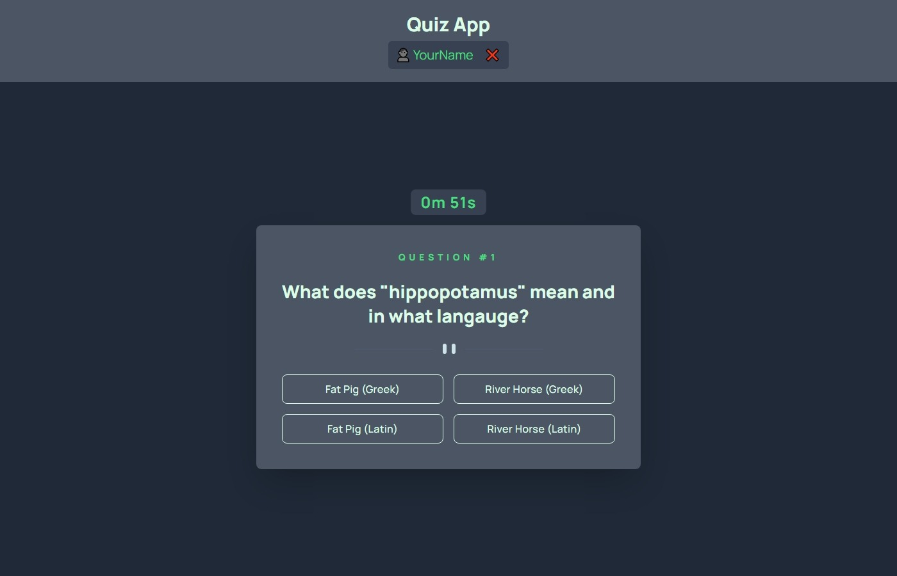

<div align="center">
<h3 align="center">Quiz App</h3>
  <p align="center">
    A simple Quiz App.
    <br />
    <br />
    <a href="https://suzumantan-blogr-nextjs-prisma-main.vercel.app/">View Demo</a>
    ·
    <a href="https://github.com/agusthas/blogr-nextjs-prisma-main/issues">Report Bug</a>
    ·
    <a href="https://github.com/agusthas/blogr-nextjs-prisma-main/issues">Request Feature</a>
  </p>
</div>

## About The Project

[![Blogr][product-screenshot]](https://vercel.com/susumantan/suzumantan-quiz-app)


### Built With

- [Next.js](https://nextjs.org/)
- [TailwindCSS](https://tailwindcss.com/)

<p align="right"><a href="#top">⬆</a></p>

## Getting Started

### Prerequisites

This is an example of how to list things you need to use the software and how to install them.

- [Node.js](https://nodejs.org/en/download/)

### Installation

1. Clone the repo (I recommend using [`gh`](https://cli.github.com/))
   ```sh
   # With gh
   gh repo clone agusthas/quiz-app
   ```
1. `cd` into repo and install NPM packages
   ```sh
   cd quiz-app && npm install
   ```
1. Run `npm run dev` on the command line

<p align="right"><a href="#top">⬆</a></p>

## Contact

SuzuMantan - [@agusthas](https://twitter.com/agusthas) - suzumantan@gmail.com

Project Link: [GitHub Repo](https://github.com/agusthas/quiz-app)

<p align="right"><a href="#top">⬆</a></p>

<!-- MARKDOWN LINKS & IMAGES -->
<!-- https://www.markdownguide.org/basic-syntax/#reference-style-links -->

[product-screenshot]: docs/screenshot.png
